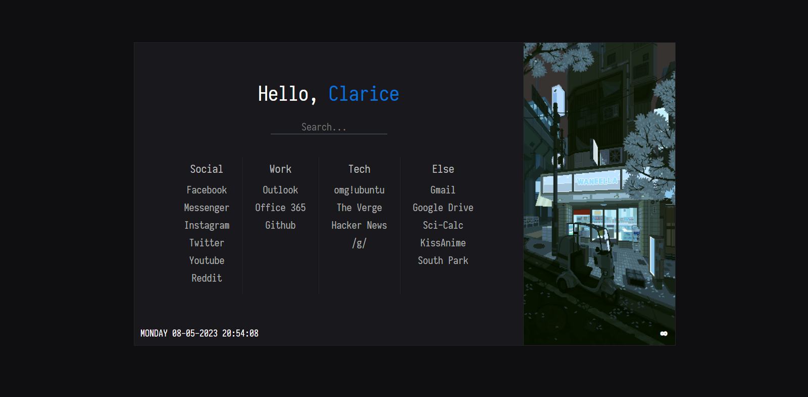

homepage 1.0
=============

### Live Demo: <a href="https://djordjeivanovic9.github.io/homepage/">Demo</a>

### Default Home

This is a fork of RamenMaestro's [startpage](https://github.com/RamenMaestro/startpage) with a image scroll option, larger option size, added favicon and search bar.  

## Credits
RamenMaestro's Github page [link](https://github.com/RamenMaestro/startpage). \
Images used in the sidebar are by background artist [Waneella](https://twitter.com/waneella_).\
Search bar is powered by DuckDuckGo [quack](https://duckduckgo.com/). 

## What can i change here?
You can change name, bookmarks, favicon, search bar provider.

**Note:** All elements that can be changed will be clearly marked (commented) in the files in this repository.